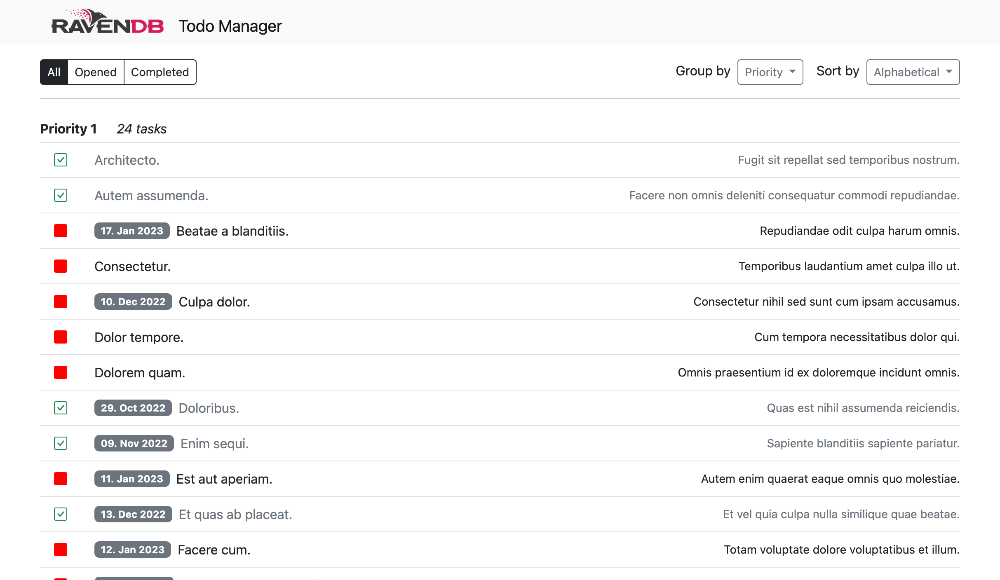

RavenDB Laravel Demo Application
====================================

The "_RavenDB Laravel Demo Application_" is a reference application created 
to show how to develop _Laravel_ applications using [RavenDB](https://ravendb.net/) database.



## Requirements

- PHP 8.1.0 or higher
- DS PHP extension enabled
- Docker
- usual Laravel application requirements

## Installation

Before you begin, you should ensure that your local machine has PHP and [Composer](https://getcomposer.org/) installed.

```bash
composer create-project ravendb/samples-php-laravel demo-app
```

Copy `.env.example` to `.env` file in project root folder.

Make sure that docker is started and running. Start application containers with: 
```
./vendor/bin/sail up
```

Create secret key for the application:
```bash
./vendor/bin/sail artisan key:generate
```

## Database seeding

To create database and seed the data run the command:

```bash
./vendor/bin/sail artisan ravendb:seed
```

Default database `Northwind` will be created. You can access it directly through 
_RavenDB Studio_ on address: [http://localhost:8080](http://localhost:8080)   

## Access the application

Access the application in your browser at the given URL [http://localhost/](http://localhost/).

---


